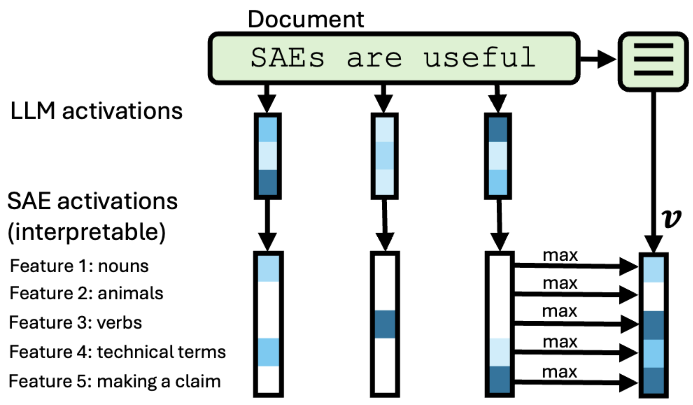

<p align="center">
  <h1 align="center">Interpretable Embeddings with Sparse Autoencoders: A Data Analysis Toolkit</h1>
</p>

InterpEmbed is an exploratory toolkit for analyzing unstructured text datasets with sparse autoencoders (SAEs).
- [Read our paper](https://arxiv.org/abs/2512.10092) or the [project page](interp-embed.com)
- Example uses: dataset comparisons, bias detection, controllable clustering (notebooks coming soon..)
- See our [case studies](interp-embed.com) on qualitatively comparing frontier models and debugging post-training datasets.


For code to reproduce our paper, see the `paper/` directory.
## Setup

To install:
```bash
uv add git+https://github.com/nickjiang2378/interp_embed
# or
pip install git+https://github.com/nickjiang2378/interp_embed
```

For local development:
```bash
git clone git@github.com:nickjiang2378/interp_embed
cd interp_embed
uv sync # To install uv, see https://docs.astral.sh/uv/getting-started/installation/
# or
pip install -e .
```

Create a `.env` file that has `OPENROUTER_API_KEY` and `OPENAI_KEY`. We use these models for creating feature labels if they don't exist. Please also sign into the hugging face cli when accessing models from gated repos (e.g. if you use GoodfireSAE, make sure to have access to Llama-3.1-8B-Instruct).

## Quickstart
First, create a dataset object. We currently support SAEs from SAELens (`LocalSAE`) and Goodfire (`GoodfireSAE`).

```python
from interp_embed import Dataset
from interp_embed.sae import GoodfireSAE
import pandas as pd

# 1. Load a Goodfire SAE or SAE supported through the SAELens package
sae = GoodfireSAE(
    variant_name="Llama-3.1-8B-Instruct-SAE-l19",
    device="cuda:0",
)

# 2. Prepare your data as a DataFrame
df = pd.DataFrame({
    "text": ["Good morning!", "Hello there!", "Good afternoon."],
    "date": ["2022-01-10", "2021-08-23", "2023-03-14"]
})

# 3. Create dataset - computes and saves feature activations
dataset = Dataset(
    data=df,
    sae=sae,
    field="text",  # Optional. Column containing text to analyze
    save_path="my_dataset.pkl"  # Optional. Auto-saves progress, which enables recovery if computations fail
)

# 4. In the future, load saved dataset to skip expensive recomputation.
dataset = Dataset.load_from_file("my_dataset.pkl") # # If some activations failed, use 'resume=True' to continue.
```

Here are some commonly used methods.
```python
# Get feature activations as a sparse matrix of shape (N = # documents, F = # features)
embeddings = dataset.latents()

# Get the feature labels if they exist from the SAE
labels = dataset.feature_labels()

# Pass in a feature index to get a more accurate label
new_label = await dataset.label_feature(feature = 65478) # example: "Friendly greetings"

# Annotate a document for a given feature, marking activating tokens with << >>.
annotated_document = dataset[0].token_activations(feature = 65478)

# Extract a list of top documents for a given feature
top_documents = dataset.top_documents_for_feature(feature = 65478)
```

For analyses (e.g. dataset diffing, correlations) done on example datasets, see the `examples/` folder.

## How does this work?


Given a dataset of text documents, we pass each document into a "reader" LLM and compute the SAE latents with a pretrained SAE (i.e. at a specific layer). For each document, we max-pool the latents across tokens to produce a single, high-dimensional, interpretable embedding whose dimensions map to granular concepts like tone, reasoning style, etc.

InterpEmbed efficiently computes and stores these embeddings for use in downstream analysis tasks (e.g. dataset comparisons). It is well-suited for detecting unknown unknowns in datasets given the large hypothesis space of SAEs.

For a brief introduction to sparse autoencoders, see [here](https://www.lesswrong.com/posts/8YnHuN55XJTDwGPMr/a-gentle-introduction-to-sparse-autoencoders) and [here](https://adamkarvonen.github.io/machine_learning/2024/06/11/sae-intuitions.html).
